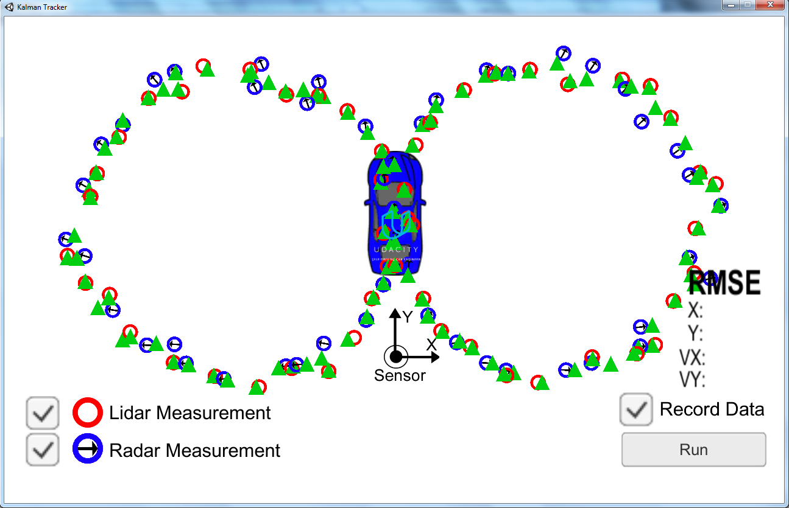
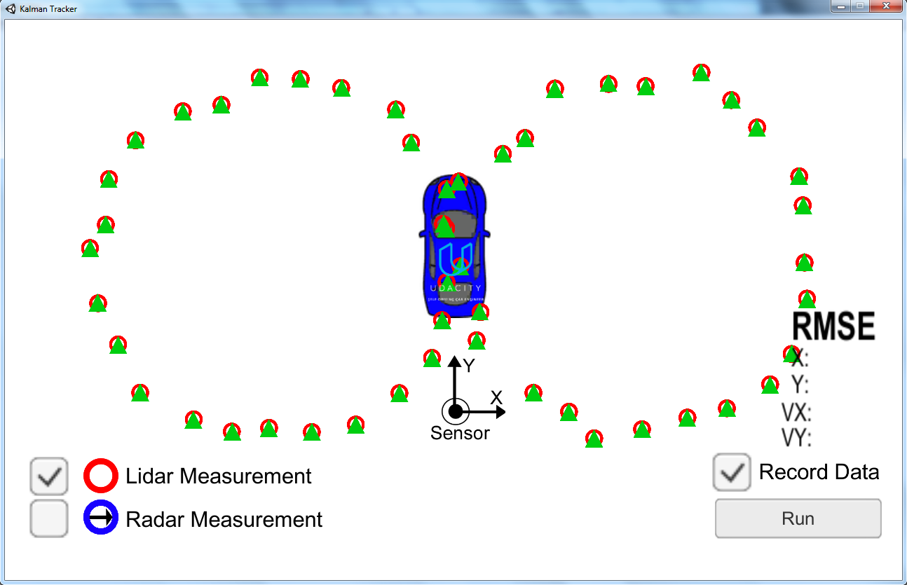
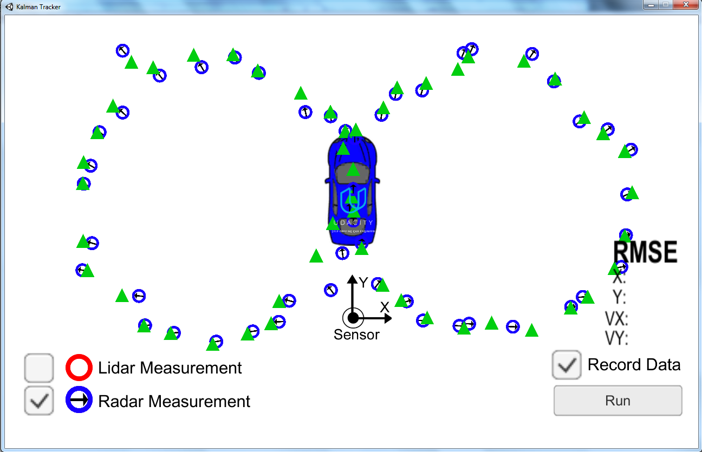

After completing the assignment and test my code with the simulator (see Figure 1 below), I verify that my results meet the acceptance criteria:

> px, py, vx, vy output coordinates must have an RMSE <= [.11, .11, 0.52, 0.52] when using the file: "obj_pose-laser-radar-synthetic-input.txt"

My accuracy (in RMSE terms):

- 0.0747761 < .11 ✓
- 0.0743069 < .11 ✓
- 0.289759 < .52 ✓
- 0.249506 < .52 ✓

 

Figure 1. Simulation using LIDAR + RADAR.

After achieving that, I wanted to give a try to the section "Ideas for Standing out!".

> Try removing radar or lidar data from the filter. Observe how your estimations change when running against a single sensor type! Do the results make sense given what you know about the nature of radar and lidar data? 

After a couple of experiments I found very interesting insights:

 

Figure 2. Simulation using only LIDAR.

 

Figure 3. Simulation using only RADAR.

| Sensor        | Px        | Py        | Vx       | Vy       |
|---------------|-----------|-----------|----------|----------|
| LIDAR         | **0.0881646** | **0.0978562** | 0.370842 | 0.349284 |
| RADAR         | 0.126346  | 0.132268  | **0.295413** | **0.304822** |
|---------------|-----------|-----------|----------|----------|
| LIDAR + RADAR | **0.0747761** | **0.0743069** | **0.289759** | **0.249506** |

Table 1. RMSE for different magnitudes and sensors.

In the table can be observed that there is no universally better sensor. LIDAR has a lower RMSE when measuring position, but RADAR is the winner when measuring speed. Combining both sensors, which is typically known as "sensor fusion", makes a great improvement in all the magnitudes measured.
